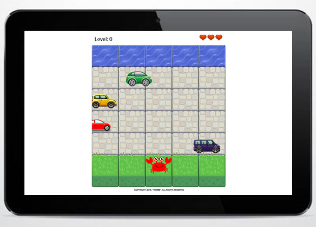

# Arcade Game

## Description
This game tries to recreate the classic arcade game Frogger. It is built on visual art assets and a game engine provided by Udacity to carry out this third project. HTML, CSS and Object-Oriented JavaScript are used

## Resources
* [Udacity Template](https://github.com/udacity/frontend-nanodegree-arcade-game)
* [Kavoon Font](https://fonts.googleapis.com/css?family=Kavoon)
* [Sounds](http://www.orangefreesounds.com)

## Objective
The player needs to move across the stone road and reach the water avoiding to collide with the enemies

## Instructions
* The game has three levels
* The player has three lives
* The player can move with the arrow keys: left, right, up and down
* If the player touches the water, one level increases
* If the player collides with an enemy, the player loses a life and returns to the starting position
* If the player loses all lives, he loses the game
* If the player reaches level three, he wins the game

## How to run the game
1. Clone the repository or download the zip file
2. Open the "index.html" file in your browser to see the game

## License
Copyright (c) 2018 Tania Ballester Marsal. This project is using [MIT License](LICENSE.md)
